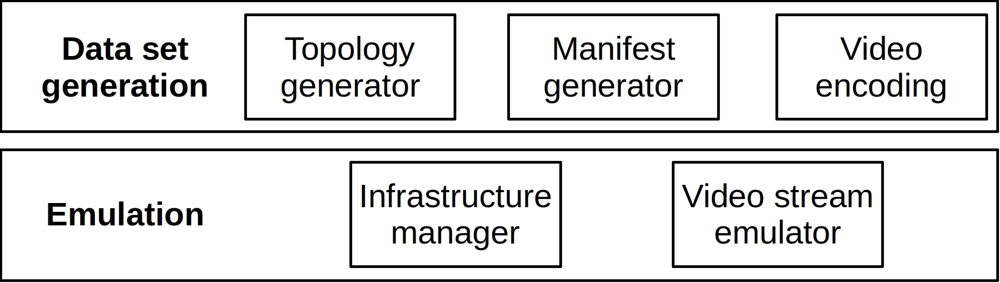
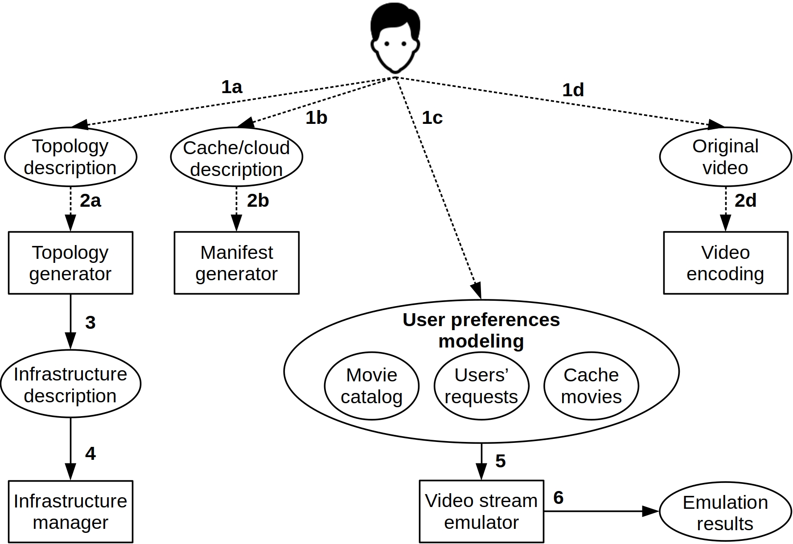

# QoE-DASH: DASH QoE Performance Evaluation Tool for Edge-Cache and Recommendation

QoE-DASH was tested in Ubuntu 20.04 LTS and Ubuntu Server 20.04 LTS. Although it may work on some other Debian-based Linux distributions, we do not guarantee that all features will work well.

- [Getting started](#getting-started)
	- [Installing the prerequisites](#installing-the-prerequisites)
	- [Cloning the repository](#cloning-the-repository)
	- [QoE-DASH architecture](#QoE-DASH-architecture)
	- [QoE-DASH workflow](#QoE-DASH-workflow)
- [Data set generation](#dataset-generation)
	- [Video enconding](#video-enconding)
	- [Manifest generator](#manifest-generator)
	- [Topology generator](#topology-generator)
- [Emulation](#emulation)
	- [Infrastructure manager](#infrastructure-manager)
	- [Video stream emulator](#video-stream-emulator)
- [QoE-DASH IEEE ICC 2022 paper](#qoe-dash-ieee-icc-2022-paper)
	- [Paper data sets](#paper-data-sets)
	- [Citation](#citation)
- [Contact us](#contact-us)

## Getting started

These instructions will guide you to get QoE-DASH up and running.

### Installing the prerequisites

```
sudo apt update
sudo apt install python3 python3-pip ffmpeg gpac net-tools openvswitch-switch git
pip3 install argparse gdown
```

**It is also necessary to install [Docker](https://docs.docker.com/), please refer to the official Docker documentation on [how to install it](https://docs.docker.com/engine/install/ubuntu/).**

### Cloning the repository

```
git clone https://github.com/LABORA-INF-UFG/QoE-DASH.git
```

### QoE-DASH architecture

The QoE-DASH architecture is divided into two modules and five sub-modules, as depicted in the figure below. Each module
and sub-module is detailed below.

<div align="center">

</div>

### QoE-DASH workflow

The QoE-DASH workflow is organized as follows. Solid arrows represent mandatory flow; dashed arrows represent optional flow; rectangles identify the system modules, and ellipses represent input and output files.

<div align="center">

</div>

## Data set generation

Data set generation is the module responsible for generating all data needed to emulate a DASH streaming service in QoE-DASH. We design this module using three sub-modules: [Video enconding](#video-enconding), [Manifest generator](#manifest-generator) and [Topology generator](#topology-generator).

### Video enconding

This sub-module provides the user the flexibility of generating different representations for a given content (steps 1d and 2d in [QoE-DASH workflow](#QoE-DASH-workflow)). The Video enconding sub-module provides the user a plethora of options, such as defining the Frames Per Second (FPS) for the representations, the bit rate for each resolution (e.g., 360p, 480p, 720p, and 1080p) and the audio bit rate, sample rate, and number of channels.

You can run the Video encoding sub-module by running the following script combined with the arguments:

```
python3 videoEncoding.py -v Video.mp4 -fps FPS -segLen X -b360 Y -b480 Z -b720 K -b1080 L -bAud M -bAr N -bAc O
```

Where:\
&nbsp;&nbsp;&nbsp;&nbsp;&nbsp;&nbsp; -v (file) – The video that will be encoded (in MP4 format).\
&nbsp;&nbsp;&nbsp;&nbsp;&nbsp;&nbsp; -fps (int) – The desired video FPS.\
&nbsp;&nbsp;&nbsp;&nbsp;&nbsp;&nbsp; -segLen (float) – DASH segment length (in seconds).\
&nbsp;&nbsp;&nbsp;&nbsp;&nbsp;&nbsp; -b360 (float) – Video bitrate (in Mbps) for 360p.\
&nbsp;&nbsp;&nbsp;&nbsp;&nbsp;&nbsp; -b480 (float) – Video bitrate (in Mbps) for 480p.\
&nbsp;&nbsp;&nbsp;&nbsp;&nbsp;&nbsp; -b720 (float) – Video bitrate (in Mbps) for 720p.\
&nbsp;&nbsp;&nbsp;&nbsp;&nbsp;&nbsp; -b1080 (float) – Video bitrate (in Mbps) for 1080p.\
&nbsp;&nbsp;&nbsp;&nbsp;&nbsp;&nbsp; -bAud (float) – Audio bit rate (in kbps).\
&nbsp;&nbsp;&nbsp;&nbsp;&nbsp;&nbsp; -bAr (float) – Audio sample rate (in kHz).\
&nbsp;&nbsp;&nbsp;&nbsp;&nbsp;&nbsp; -bAc (float) – Number of audio channels.

For reference values, we recommend using [YouTube’s recommended upload encoding settings](https://support.google.com/youtube/answer/1722171?hl=en#zippy=%2Cbitrate), associating each bitrate to your desired FPS.

Here is an example:

```
python3 videoEncoding.py -v ../../InputFiles/videoExample.mp4 -fps 48 -segLen 4 -b360 1.5 -b480 4 -b720 7.5 -b1080 12 -bAud 384 -bAr 48 -bAc 2
```

Once the video is encoded, a directory called "encodedVideo" will be created and this directory will contain the video encoded accordingly to your arguments.

There is an example of a video encoded by QoE-DASH at [InputFiles/encodedVideo](InputFiles/encodedVideo).

### Manifest generator

This sub-module is responsible for the cache modeling in QoE-DASH (steps 1b and 2b in [QoE-DASH workflow](#QoE-DASH-workflow)). The Manifest generator receives a file, denoted Cache/cloud description, describing the video representations stored in the Cache and the ones stored in the Cloud. According to this description, for each video content, a manifest is created, associating each representation of this content to a location (Cache or Cloud). This association allows the player to know where to search for each representation of a given video content.

You can run the Manifest generator sub-module by running the following script combined with the arguments:

```
python3 manifestGenerator.py -m cacheDescription -d encodedVideoLocation
```

Where:\
&nbsp;&nbsp;&nbsp;&nbsp;&nbsp;&nbsp; -m (file) – A CSV file describing the movies in cache.\
&nbsp;&nbsp;&nbsp;&nbsp;&nbsp;&nbsp; -l (directory) – The location of the video encoded by 'Video enconding'.

Here is an example:

```
python3 manifestGenerator.py -m ../../InputFiles/moviesCache.csv -l ../../InputFiles/encodedVideo
```

The cache description file details the representations that are going to be stored in the Cache.

One example of this file is 'moviesCache.csv', which is located at [InputFiles/](InputFiles/), the file is structured as follows: movieID#representation#audioLocation, where:

* **movieID** – An ID for movie that you want a representation to be stored in the Cache.
* **representation** – An integer from 1 to 4 that defines the resolution of the movie that will be stored in the Cache, where:
	* {1: 360p, 2: 480p, 3: 720p, 4: 1080p}.
* **audioLocation** – An integer (either 1 or 2) that defines where the audio chunks will be stored for that movie, where:
	* {1: Cloud, 2: Cache (MEC Host)}.

Once you run the Manifest generator, a new directory named 'cacheMovies' will be generated. This directory will contain a manifest for each representation defined on the cache description. In QoE-DASH, '10.16.0.2' is the Cloud IP, and '10.16.0.3' is the Cache IP. The representations on each manifest are located following the cache description.

An example of the output generated by the Manifest generator is located at [InputFiles/cacheMovies](InputFiles/cacheMovies).

### Topology generator

This sub-module generates the topology for QoE-DASH (steps 1a and 2a in [QoE-DASH workflow](#QoE-DASH-workflow)). The Topology generator is at [Scripts/DatasetGeneration/](Scripts/DatasetGeneration/).

You can run the Topology generator by running the following script combined with the arguments:

```
python3 topologyGenerator.py -tpd topologyDescription -ilc internetLinkCapacity -bAud audioBitRate
```

Where:\
&nbsp;&nbsp;&nbsp;&nbsp;&nbsp;&nbsp; -tpd (file) – A CSV file describing the topology.\
&nbsp;&nbsp;&nbsp;&nbsp;&nbsp;&nbsp; -ilc (float) – The internet link capacity.\
&nbsp;&nbsp;&nbsp;&nbsp;&nbsp;&nbsp; -bAud (float) – Audio bit rate (in kbps) (The same audio bitrate used to encode the video).

Here is an example:

```
python3 topologyGenerator.py -tpd ../../InputFiles/topologyDescription.csv -ilc 99 -bAud 384
```

The topology description file details the number of users in the emulation, the wireless link capacity, the maximum screen resolution for each User Equipment (UE), and the connection between each UE and each base station (BS).

One example of this file is 'topologyDescription.csv', which is located at [InputFiles/](InputFiles/), the file is structured as follows: userID#userCQI#screnRes#bsAsc, where:

* **userID** – An ID for each user.
* **userCQI** – The UE CQI. We consider the CQI to bandwidth conversion proposed in this [paper](https://doi.org/10.1109/TVT.2018.2889196) on Table I.
* **screnRes** – An integer from 1 to 4 that defines the screen resolution of the UE, where:
	* {1: 360p, 2: 480p, 3: 720p, 4: 1080p}.
* **bsAsc** – The BS to which the UE is connected.

This module also gives the flexibity of defining the Internet link capacity. This capacity  is represented as a value varying from 0% to 99% bottleneck compared to the sum of the BS capacities. For example: If the sum of the BSs capacities is 1000 Mbps, and 'ilc' is defined as 70, the internet link capacity will be 700 Mbps.

It is necessary to specify the audio bitrate used to encode the video (bAud) because QoE-DASH uses sum of 'userCQI' and 'bAud' in order to calculate the wireless link capacity of each UE.

Once you run the Topology generator, a file named 'topology.json' will be generated describing the topology for QoE-DASH. An example of this file, 'topology.json', is located at [InputFiles/](InputFiles/).

## Emulation

Emulation is a module responsible for the video emulation itself. This module comprises two main components: [Infrastructure manager](#infrastructure-manager) and [Video stream emulator](#video-stream-emulator).

**Before running the emulation**, it is necessary to setup the environment first, which consists of:

1. Downloading both QoE-DASH server Docker image (used by Cloud and MEC Host nodes) and QoE-DASH client Docker image (used by UEs nodes);
2. Copying the cache manifests and encoded video to the server image.

In order to setup the environment for QoE-DASH, first enter the [Scripts/Emulation/](Scripts/Emulation/) directory, then you can run the setup by running the following script combined with the arguments:

```
sudo python3 setup.py -c cacheMovies -e encodedVideo
```

Where:\
&nbsp;&nbsp;&nbsp;&nbsp;&nbsp;&nbsp; -c (directory) – The location of the manifests created by 'Manifest generator'.\
&nbsp;&nbsp;&nbsp;&nbsp;&nbsp;&nbsp; -e (directory) – The location of the video that was enconded by 'Video enconding'.

Here is an example:

```
sudo python3 setup.py -c ../../InputFiles/cacheMovies -e ../../InputFiles/encodedVideo
```

Note: It is necessary to run this sub-module with 'sudo' because Docker requires 'sudo'.

Once the environment is ready, it is time to call the Infrastructure manager.

### Infrastructure manager

This sub-module creates the network nodes and links of the topology and configures each link. It receives the topology file (Infrastructure description) created by the [Topology generator](#topology-generator) and deploys the network topology accordingly (step 4 in [QoE-DASH workflow](#QoE-DASH-workflow)). Once the emulation is done, the Infrastructure manager is responsible for destroying the emulated topology.

You can create the emulated infrastructure with Infrastructure manager sub-module by running the following script combined with the arguments:

```
sudo python3 infrastructureManager.py -t topologyFile -c
```

You can also destroy the emulated infrastructure with:

```
sudo python3 infrastructureManager.py -t topologyFile -d -r
```

Where:\
&nbsp;&nbsp;&nbsp;&nbsp;&nbsp;&nbsp; -t (file) – The topology file created by the Topology generator.\
&nbsp;&nbsp;&nbsp;&nbsp;&nbsp;&nbsp; -c (flag) – Indicates that you want to create the infrastructure.\
&nbsp;&nbsp;&nbsp;&nbsp;&nbsp;&nbsp; -d (flag) – Indicates that you want to destroy the infrastructure.\
&nbsp;&nbsp;&nbsp;&nbsp;&nbsp;&nbsp; -r (flag) – Indicates that you want to remove the QoE-DASH Docker images.

Here is an example on how to create an infrastructure:

```
sudo python3 infrastructureManager.py -t ../../InputFiles/topology.json -c
```

Here is an example on how to destroy an infrastructure:

```
sudo python3 infrastructureManager.py -t ../../InputFiles/topology.json -d
```

Note: It is necessary to run this sub-module with 'sudo' because it uses [Open vSwitch](https://www.openvswitch.org/) to create the network bridges and it requires 'sudo'.

Once we have an infrastructure, it is time to start the video streaming!

### Video stream emulator

The Video stream emulator allows the user to specify user preferences and to start an emulation (steps 5 and 6 in [QoE-DASH workflow](#QoE-DASH-workflow)).

User preferences are described using three files: the video content catalog (Movie catalog), the video representations in the cache (Cache movies), and the video representation that each user will request (Users’ requests). These files can be generated outside the tool using a joint caching and recommendation model.

Once the infrastructure has been deployed and the user preferences have been provided, the Video stream emulator prepares the UEs for the emulation by configuring them according to the users preferences descriptions. Then, the Video stream emulator invokes [goDASH](https://github.com/uccmisl/godash) to stream each video requested by each user using the manifests files created by the Manifest generator. Once the emulation is completed, the sub-module provides the results collected for each user (Emulation results).

You run the Video stream emulator sub-module by running the following script combined with the arguments:

```
sudo python3 videoStreamEmulator.py -c movieCatalog -m cacheMovies -u usersRequests -t topologyFile
```

Where:\
&nbsp;&nbsp;&nbsp;&nbsp;&nbsp;&nbsp; -c (file) – A CSV file describing the movie catalog.\
&nbsp;&nbsp;&nbsp;&nbsp;&nbsp;&nbsp; -m (file) – A CSV file describing the movies in cache.\
&nbsp;&nbsp;&nbsp;&nbsp;&nbsp;&nbsp; -u (file) – A CSV file describing the movies the users are going to request.\
&nbsp;&nbsp;&nbsp;&nbsp;&nbsp;&nbsp; -t (file) – The topology file created by the Topology generator.

Here is an example:

```
sudo python3 videoStreamEmulator.py -c ../../InputFiles/simpleCatalog.csv -m ../../InputFiles/moviesCache.csv -u ../../InputFiles/usersReq.csv -t ../../InputFiles/topology.json
```

Notes: 

1. It is necessary to run this sub-module with 'sudo' because Docker requires 'sudo';
2. The movie catalog file details the movies that users can requests. One example of this file is [The Movie Database (TMDB)](https://www.themoviedb.org/) catalog we created 'tmdbCatalog.csv', which is located at [InputFiles/](InputFiles/). Although this file contains many columns, QoE-DASH only needs "movieID" and "RUNTIME (SECONDS)". There is another simpler example 'simpleCatalog.csv' also at [InputFiles/](InputFiles/);
3. usersReq is organized as follows:
	* **userID** – An ID for each user.
	* **movieID** – The movie which the user will request.
	* **representation** – An integer from 1 to 4 that defines the representation of the movie the user will request, where:
		* {1: 360p, 2: 480p, 3: 720p, 4: 1080p}.
4. As all chunks are emulated, the emulation will last until the longest movie ends. For 'simpleCatalog.csv', 32 seconds;
5. The results are exported in CSV at "EmulationResults". Please note that as 'sudo' is required by Docker, the results come as "read only". You can change ownership with: "sudo chown -R $USER EmulationResults".

## QoE-DASH IEEE ICC 2022 paper

For more information, read the [QoE-DASH IEEE ICC 2022 paper](https://www.researchgate.net/publication/358063135_QoE-DASH_DASH_QoE_Performance_Evaluation_Tool_for_Edge-Cache_and_Recommendation).

### Paper data sets

The data set we generated for the IEEE ICC 2022 paper is publicly available. Due to the data set size, we divided it into four compressed files, each with four resolutions (360p, 480p, 720p, 1080p) and a different FPS (either 24 FPS, or 30 FPS, or 48 FPS or 60 FPS). If you prefer, you can also download the complete data set with all different resolutions and FPSs as well.

Please check the data set file size before downloading it:

<div align="center">

| Data set | File size |
|:--------:|:---------:|
|  24 FPS  |   14 GB   |
|  30 FPS  |   14 GB   |
|  48 FPS  |   22 GB   |
|  60 FPS  |   22 GB   |
|   Full   |   70 GB   |

</div>

In order to do download the data set you chose, first enter the [Scripts/IEEE-ICC-Dataset/](Scripts/IEEE-ICC-Dataset/) directory inside the repository you cloned, then run the script accordingly to your choice:

* **24 FPS**
```
python3 datasetDownloader.py -24
```

* **30 FPS**
```
python3 datasetDownloader.py -30
```

* **48 FPS**
```
python3 datasetDownloader.py -48
```

* **60 FPS**
```
python3 datasetDownloader.py -60
```

* **Full**
```
python3 datasetDownloader.py -full
```

In order to create the data sets, we first downloaded this [*No Copyright* video from YouTube](https://www.youtube.com/watch?v=zdZ97vxMfkE&ab_channel=GKorb), then we created a 2 hour version of the original video with [FFmpeg](https://video.stackexchange.com/questions/12905/repeat-loop-input-video-with-ffmpeg), and finally we used the [Video encoding](#video-enconding) and the [Manifest generator](#manifest-generator) sub-modules to generate the data sets.

Feel free to use the data sets and QoE-DASH! Please do not forget to cite our paper! :)

### Citation

```
@inproceedings{esper2022qoe,
  author={Esper, Jo{\~a}o Paulo and Mon{\c{c}}{\~a}o, Ana Claudia Bastos Loureiro and Rodrigues, Karlla B Chaves and Both, Cristiano Bonato and Corr{\^e}a, Sand Luz and Cardoso, Kleber Vieira},
  title={{QoE-DASH: DASH QoE Performance Evaluation Tool for Edge-Cache and Recommendation}},
  year={2022},
  pages={757--762},
  organization={IEEE},
  booktitle={ICC 2022-IEEE International Conference on Communications},
  doi={10.1109/ICC45855.2022.9839234}
}
```

## Contact us

If you would like to contact us to contribute to this project, ask questions or suggest improvements, feel free to e-mail us at: qoedash@gmail.com